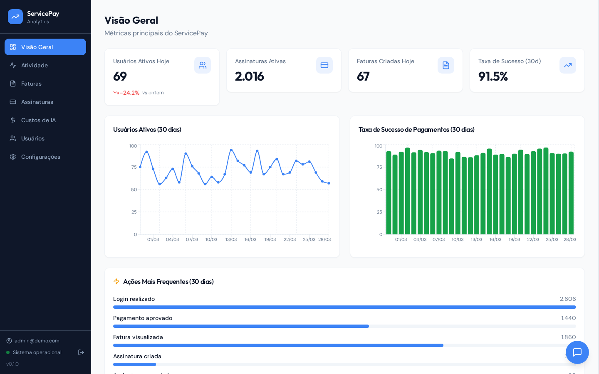
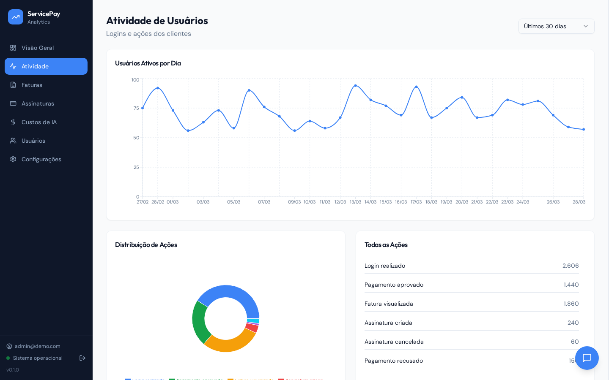
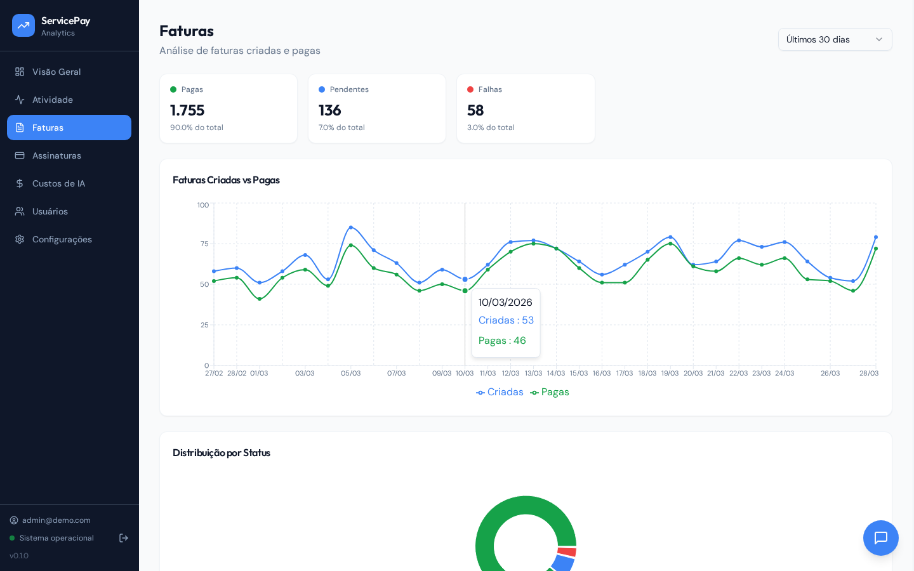
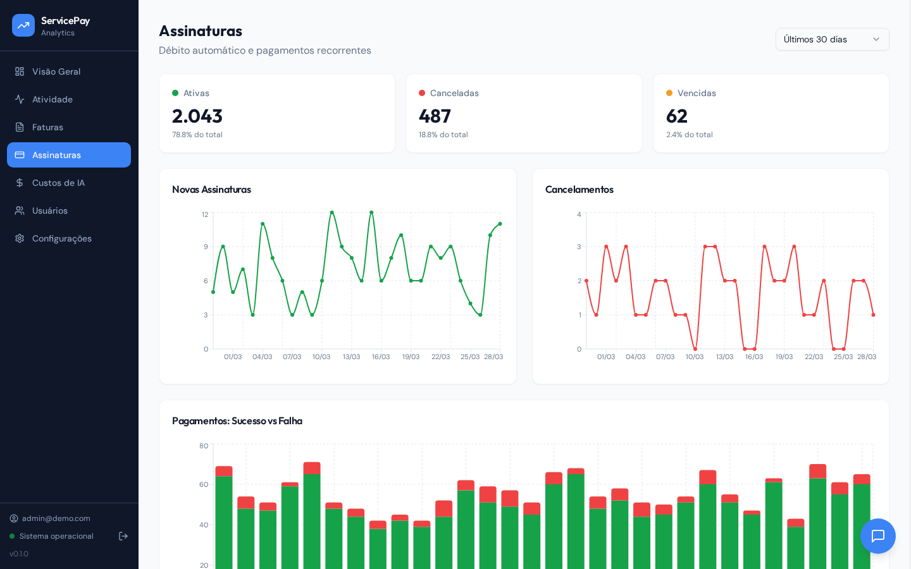
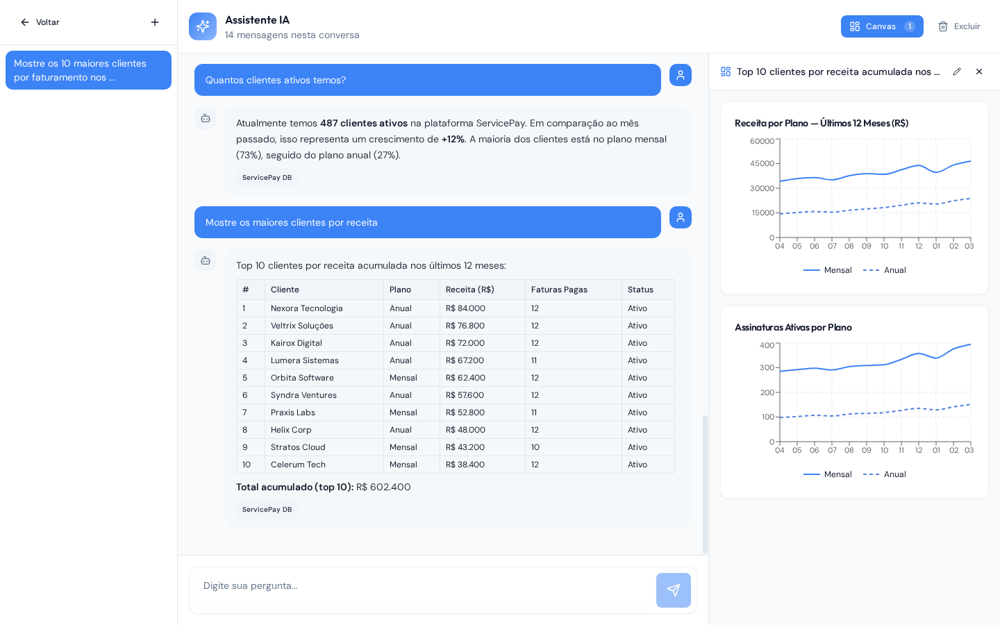
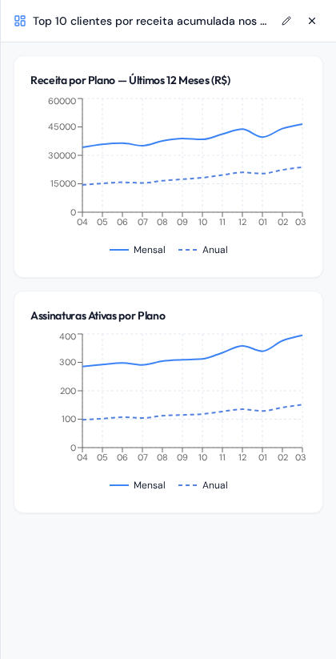

# ServicePay Analytics

[](https://python.org)
[](https://fastapi.tiangolo.com)
[](https://react.dev)
[](https://vitejs.dev)
[](LICENSE)
[](https://github.com/ansonne/saas-analytics/actions/workflows/ci.yml)

A full-stack product analytics platform with an embedded AI assistant that answers natural language questions about your SaaS data — and renders the results as charts, tables, and cards directly in the chat.



## Features

- **Analytics Dashboard** — live charts for activity, invoices, subscriptions, and payment success rates
- **AI Chat Sidebar** — ask questions in plain language; the assistant queries your data and responds in context
- **Canvas Visualizations** — complex queries automatically generate bar charts, line graphs, and stat cards alongside the answer
- **Streaming Responses** — real-time token-by-token output via SSE, with a typing indicator
- **Full-screen Chat** — dedicated `/chat` page with a side-by-side canvas panel for richer data exploration
- **JWT Auth** — role-based login (MASTER / ADMIN / USER), password management
- **LLM Cost Tracking** — per-message token usage and cost monitoring

## Screenshots

<div align="center">

&nbsp;

*Activity — daily active users + action breakdown* &nbsp;&nbsp;&nbsp;&nbsp;&nbsp;&nbsp;&nbsp;&nbsp;&nbsp;&nbsp;&nbsp;&nbsp;&nbsp;&nbsp;&nbsp;&nbsp;&nbsp;&nbsp;&nbsp;&nbsp;&nbsp;&nbsp;&nbsp;&nbsp;&nbsp;&nbsp;&nbsp;&nbsp;&nbsp;&nbsp;&nbsp;&nbsp;&nbsp;&nbsp;&nbsp;&nbsp;&nbsp;&nbsp;&nbsp;&nbsp;&nbsp;&nbsp;&nbsp;&nbsp;&nbsp;&nbsp;&nbsp;&nbsp;&nbsp;&nbsp;&nbsp;&nbsp;&nbsp;&nbsp; *Invoices — created vs paid + status distribution*



*Subscriptions — new, cancelled, payment success*

</div>

### AI Chat with Canvas

Ask a complex question and the assistant returns a structured table in the chat while simultaneously rendering charts in the canvas panel:

<div align="center">



*Table answer in chat with canvas panel open side-by-side*

</div>

The canvas panel renders charts and stats directly from the agent's response — no extra API calls:

<div align="center">



*Line charts (revenue + subscriptions by plan, solid vs dashed)*

</div>

## Architecture

Single unified service — no microservices, no background workers:

| Layer | Technology |
|---|---|
| Backend | FastAPI (Python 3.12) |
| Frontend | React 18 + Vite + TailwindCSS |
| AI Agent | [Agno](https://github.com/agno-agi/agno) + OpenRouter |
| Streaming | Server-Sent Events (SSE) |
| Internal DB | SQLAlchemy + SQLite (dev) / MySQL (prod) |
| Data source | Pluggable MCP tool (mock in this demo) |

The AI agent communicates with the data layer through an [MCP](https://modelcontextprotocol.io/) tool, making it straightforward to swap the mock backend for a real database without touching the agent logic.

## Pages

| Route | Description |
|---|---|
| `/` | Overview — key KPI cards + charts |
| `/activity` | Audit log activity — DAU and action breakdown |
| `/invoices` | Invoice status, amounts, and trends |
| `/subscriptions` | Subscriptions, cancellations, and payment success |
| `/chat` | Full-screen AI chat with canvas panel |
| `/costs` | LLM token usage and cost tracking |
| `/settings` | Agent runtime configuration |
| `/users` | User management |
| `/account` | Password change |

## Running locally

**Requirements**: Python 3.11+, Node 20+, [uv](https://github.com/astral-sh/uv)

```bash
# Install dependencies
uv sync
cd dashboard && npm install && cd ..

# Copy and fill in the env file
cp .env.example .env
```

```bash
# Run backend (port 8000) + frontend dev server (port 5173)
make dashboard

# Or backend only
make run
```

The demo ships with a mock data backend — no external database required. On first start, a master account is created and the password is printed to the terminal.

### Environment variables

```env
LLM_API_KEY=your-openrouter-key   # Required for real AI responses
DATABASE_URL=sqlite+aiosqlite:///./demo.db
JWT_SECRET=change-me-in-production
MASTER_EMAIL=admin@demo.com
```

> In this demo the AI responses are scripted and do not require a real `LLM_API_KEY`. To connect a real LLM, provide a valid [OpenRouter](https://openrouter.ai/) key and wire up an actual data source in `src/tools/`.

## Docker

```bash
docker build -t saas-analytics .
docker run -p 8000:8000 --env-file .env saas-analytics
```

## Development

```bash
make check    # format + lint
make format   # format only
make lint     # lint only
```

## How the canvas works

The AI agent can embed a `~~~canvas` JSON block at the end of its response. The frontend parses this block, strips it from the visible message, and renders the described components (charts, stat cards) in the side panel — all without any extra API calls.

```
~~~canvas
{"components": [
  {"type": "BarChart", "props": {"title": "Monthly Revenue", "data": [...]}},
  {"type": "LineChart", "props": {"title": "Active Subscriptions", "lines": [...]}}
]}
~~~
```

Supported canvas components: `BarChart`, `LineChart`, `PieChart`, `StatCard`.
